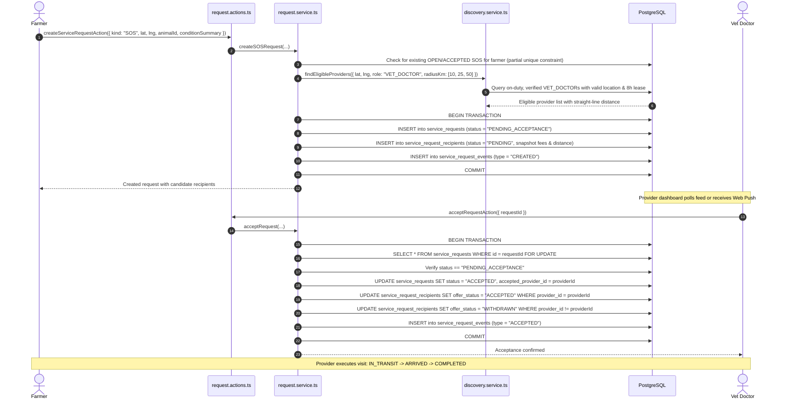
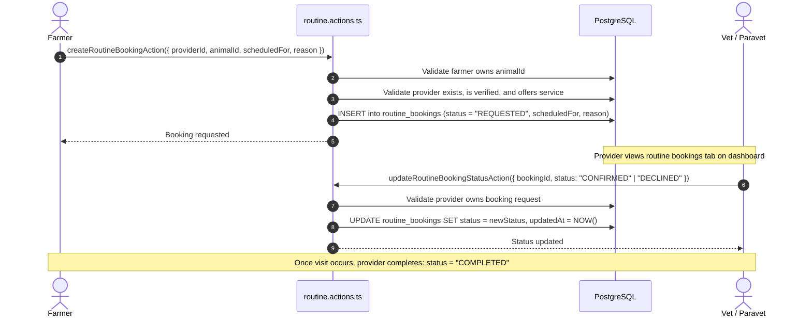
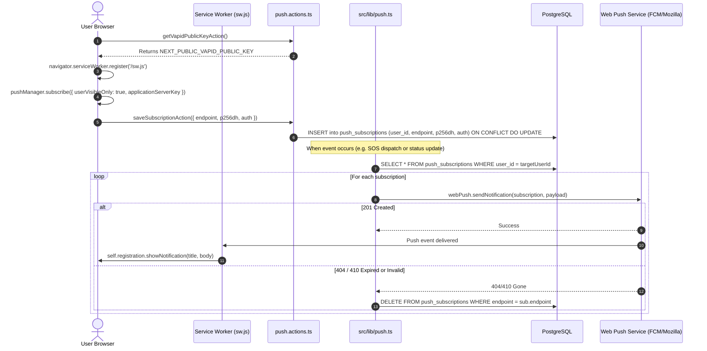
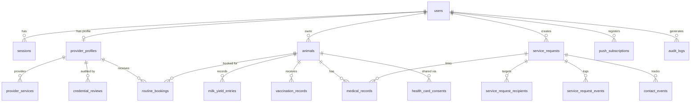

# PashuSeva — Architecture Documentation

This document describes the architectural layout, core subsystems, data model, and transaction flows of the PashuSeva platform as implemented.

---

## 1. System Layout & Architecture Overview

PashuSeva is built as a full-stack, mobile-first web application designed for rural Indian connectivity constraints with a strict zero-paid-API boundary.

```
┌───────────────────────────────────────────────────────────────────────────┐
│                           Client / Web Browser                            │
│  - Mobile Viewports (360px - 430px)                                       │
│  - Bilingual UI (English / Hindi via Server Dictionaries)                 │
│  - Leaflet Map (client-side dynamic import) + OpenStreetMap Tiles         │
│  - Service Worker (sw.js) for Web Push Notifications                      │
│  - Native Intent Links (tel:, https://wa.me/)                             │
└─────────────────────────────────────┬─────────────────────────────────────┘
                                      │ HTTP / HTTPS (JSON & Server Actions)
┌─────────────────────────────────────▼─────────────────────────────────────┐
│                       Next.js 15 App Router Layer                         │
│  - Route Handlers & Pages: src/app/[locale]/...                           │
│  - Server Components (default) & Client Component Boundaries              │
│  - Server Actions: src/actions/*.actions.ts                               │
│  - Session Extraction & Role Guards (requireFarmer, requireProvider, etc)│
└─────────────────────────────────────┬─────────────────────────────────────┘
                                      │ In-process Function Calls
┌─────────────────────────────────────▼─────────────────────────────────────┐
│                          Service & Domain Layer                           │
│  - src/services/auth.service.ts       - src/services/discovery.service.ts  │
│  - src/services/request.service.ts    - src/services/provider.service.ts   │
│  - src/lib/push.ts (Web Push/VAPID)   - src/lib/fees.ts (Integer Paise)   │
│  - src/lib/rate-limit.ts (Atomic DB)  - src/lib/auth/pin.ts (scrypt)      │
└─────────────────────────────────────┬─────────────────────────────────────┘
                                      │ Parameterized SQL Queries & Transactions
┌─────────────────────────────────────▼─────────────────────────────────────┐
│                       Persistence & Database Layer                        │
│  - PostgreSQL 16 + Drizzle ORM (drizzle-orm, pg driver)                  │
│  - PostGIS 3.5 Extension (ST_DWithin, ST_DistanceSphere)                  │
│  - SQL Haversine Fallback with LEAST/GREATEST clamping                    │
│  - Private File Storage: storage/documents/                               │
└───────────────────────────────────────────────────────────────────────────┘
```

### Key Layering Rules
1. **Presentation Layer (`src/app/`, `src/components/`)**:
   - Server Components render UI from pre-fetched data and pass localized dictionary strings (`dict`) down to interactive Client Components (`"use client"`).
   - Interactive boundaries handle client state, form handling, and native browser APIs (e.g. Geolocation, Push API, Leaflet).
2. **Action Layer (`src/actions/`)**:
   - Server Actions are marked `"use server"` and act as secure network entry points.
   - Validate incoming payloads using Zod schemas.
   - Enforce session authentication and role authorizations (`requireSession`, `requireFarmer`, `requireProvider`, `requireAdmin`).
3. **Service Layer (`src/services/`)**:
   - Contains business logic, multi-tier discovery calculations, status transitions, and transaction boundaries.
4. **Data Access Layer (`src/db/`)**:
   - Drizzle ORM defines tables, schemas, relations, and enums in `src/db/schema/`.
   - Raw database queries use parameterized SQL templates (`sql` from `drizzle-orm`) to prevent SQL injection.

---

## 2. Session & Authorization Model

### 2.1 Session Model
- **Token Format**: Stateless signed JSON Web Tokens (JWT) using `jose` with HMAC-SHA256 (`HS256`).
- **Cookie Security**: Tokens are issued into an HTTP-only, `SameSite=Lax`, `Secure` (in production) cookie (`pashuseva_session`).
- **Database Tracking & Revocation**:
  - Every token issuance generates a unique session record in the `sessions` table containing `token_hash` (SHA-256 of the token string) and `expires_at`.
  - Every incoming authenticated request executes a fast indexed query:
    ```sql
    SELECT s.*, u.is_active, u.role
    FROM sessions s
    JOIN users u ON u.id = s.user_id
    WHERE s.token_hash = $1
      AND s.revoked_at IS NULL
      AND s.expires_at > NOW()
      AND u.is_active = true;
    ```
  - Immediate revocation occurs on user logout, operator PIN reset, and administrative account suspension.

### 2.2 Authorization Model & Role Guards
PashuSeva uses strict server-side role gating:
- `requireSession()`: Validates that a non-revoked session cookie exists and returns the authenticated user object.
- `requireFarmer()`: Asserts `user.role === 'FARMER'`. Rejects all others.
- `requireProvider()`: Asserts `user.role === 'VET_DOCTOR' || user.role === 'PARAVET_WORKER'`.
- `requireVerifiedProvider()`: Asserts provider role AND `provider_profiles.verification_status === 'VERIFIED'`.
- `requireAdmin()`: Asserts `user.role === 'ADMIN'`.

---

## 3. Core Operational Flows

### 3.1 Emergency SOS Dispatch & Lifecycle Flow

SOS requests represent urgent medical calls requiring nearby veterinary doctor response.



#### State Machine & Transitions
- `PENDING_ACCEPTANCE`: Request created; offers visible to candidate recipient providers.
- `ACCEPTED`: Exactly one provider accepted the request. Other recipient offers are transitioned to `WITHDRAWN`.
- `IN_TRANSIT`: Assigned provider is en route to farmer's location.
- `ARRIVED`: Assigned provider has reached the animal's location.
- `COMPLETED`: Visit finished and care administered.
- `CANCELLED`: Farmer cancelled before arrival (records reason and actor).
- `EXPIRED`: Request reached time-to-live without any provider accepting.
- `DECLINED`: Provider explicitly declined; returns request to dispatch pool or marks recipient offer `DECLINED`.

#### Concurrency & Acceptance Locking
When multiple candidate providers attempt to accept the same SOS request simultaneously, database row-level locking (`FOR UPDATE`) guarantees mutual exclusion:
1. The first transaction acquires the row lock on `service_requests`.
2. It verifies `status === 'PENDING_ACCEPTANCE'`.
3. It sets `status = 'ACCEPTED'`, sets `accepted_provider_id = :providerId`, and marks all other candidate recipient records in `service_request_recipients` as `WITHDRAWN`.
4. Subsequent concurrent transactions unlock, read the modified status (`ACCEPTED`), and fail gracefully with an error informing the provider that the request was already accepted by another practitioner.

---

### 3.2 Routine Booking Flow

Routine requests allow livestock owners to schedule non-emergency veterinary visits, vaccinations, or artificial inseminations in advance.



---

### 3.3 Web Push Notification Flow

PashuSeva uses the W3C Push API and VAPID protocol (`web-push`) for zero-cost browser push notifications.



---

### 3.4 Polling Behavior & Client Sync

In environments where Web Push is unsupported, ungranted, or suspended by low-power mobile browser states:
1. **Provider Live Feed**: The provider dashboard polls active pending offers every **10 seconds** when the tab is visible (`document.visibilityState === 'visible'`).
2. **Farmer SOS Status Screen**: When an SOS request is pending or in transit, the farmer view polls request status every **5 seconds**.
3. **Backoff on Hidden Tabs**: Polling automatically pauses or throttles to 60-second intervals when the browser tab is backgrounded.

---

## 4. Data Model Overview & Provenance

The database schema is organized into logical domain modules managed via Drizzle ORM:



### Table Definitions & Data Provenance
1. **Identity & Auth**:
   - `users`: Core account identity (`id`, `phone`, `pin_hash`, `role`, `name`, `preferred_locale`, `is_active`, `phone_verified_at`, `is_demo`).
   - `sessions`: Active JWT sessions (`id`, `user_id`, `token_hash`, `expires_at`, `revoked_at`).
2. **Provider Lifecycle & Audit**:
   - `provider_profiles`: Practitioner details (`user_id`, `qualification`, `registration_number`, `registration_number_normalized`, `registration_authority`, `registration_document_path`, `verification_status`, `duty_status`, `duty_expires_at`, `latitude`, `longitude`, `base_visit_fee_paise`, `per_km_fee_paise`).
   - `provider_services`: Catalog of services enabled per provider.
   - `credential_reviews`: Append-only review history (`id`, `provider_id`, `decision`, `reviewer_reference`, `evidence_reference`, `notes`).
3. **Emergency & Dispatch**:
   - `service_requests`: Central SOS and service orders (`id`, `farmer_id`, `animal_id`, `kind`, `status`, `condition_summary`, `latitude`, `longitude`, `accepted_provider_id`, `scheduled_for`).
   - `service_request_recipients`: Candidate providers dispatched an offer (`id`, `request_id`, `provider_id`, `offer_status`, `distance_m_snapshot`, fee snapshots).
   - `service_request_events`: Audit trail of status transitions.
   - `contact_events`: Intent clicks on `tel:` and `wa.me/` URLs.
4. **Routine & Scheduled Services**:
   - `routine_bookings`: Scheduled non-emergency appointments (`id`, `farmer_id`, `animal_id`, `provider_id`, `scheduled_for`, `reason`, `status`).
5. **Cattle Health Cards (Pashu Swasthya Patra)**:
   - `animals`: Livestock inventory (`id`, `farmer_id`, `tag_id`, `name`, `species`, `breed`, `sex`, `date_of_birth`).
   - `milk_yield_entries`: Daily milk production logs.
   - `vaccination_records`: Vaccines given and upcoming due dates (`next_due_on`, `reminder_dismissed`).
   - `medical_records`: Clinical notes, diagnoses, symptoms, treatments.
   - `health_card_consents`: Time-bounded temporary access grants from farmer to provider (`granted_by`, `granted_to`, `animal_id`, `expires_at`, `revoked_at`).
6. **Platform Security & Operations**:
   - `rate_limit_buckets`: Atomic rate limit counters (`key_hash`, `window_start`, `count`, `expires_at`).
   - `push_subscriptions`: Web Push browser subscription tokens (`user_id`, `endpoint`, `p256dh`, `auth`).
   - `audit_logs`: Operational security events.

---

## 5. Spatial Strategy & Distance Computation

Provider discovery calculates straight-line distance directly inside PostgreSQL without in-memory row downloads.

### Spatial Query Modes (`DB_SPATIAL_MODE`):
1. **`postgis`**:
   - Uses PostGIS `ST_DWithin(location_geog, origin.geog, radiusMeters, false)` for spatial indexing via GiST.
   - Uses `ST_DistanceSphere(location_geog::geometry, origin.geog::geometry)` for exact distance in meters.
2. **`haversine` (Fallback)**:
   - Portable parameterized SQL Haversine calculation:
     $$\text{distanceMeters} = 2 \times 6371008.8 \times \arcsin\left(\sqrt{\operatorname{clamp}(a, 0.0, 1.0)}\right)$$
   - Clamped with `LEAST(1.0, GREATEST(0.0, ...))` inside SQL to prevent domain errors (`NaN`) from floating-point inaccuracies.
3. **`auto`**:
   - Automatically probes for PostGIS table/column availability at runtime and defaults to Haversine if PostGIS is not present.

---

## 6. Pricing & Fee Engine

Fees are calculated strictly in integer paise (`1 INR = 100 paise`) to eliminate floating-point rounding discrepancies:

$$\text{travelFeePaise} = \operatorname{round}\left(\frac{\text{distanceMeters}}{1000} \times \text{perKmFeePaise}\right)$$
$$\text{totalEstimatedFeePaise} = \text{baseVisitFeePaise} + \text{travelFeePaise}$$

- Fees are snapshots saved to `service_request_recipients` at creation time.
- Display values are converted to INR using `Intl.NumberFormat('en-IN', { style: 'currency', currency: 'INR' })`.
